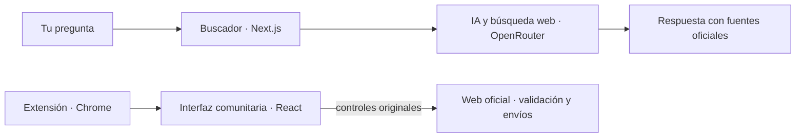

<p align="center">
  
</p>

<h1 align="center">Reforma Digital</h1>

<p align="center">
  <strong>La próxima reforma de la Administración, hecha en comunidad.</strong><br>
  Una iniciativa abierta para que relacionarse con el Estado sea más claro, accesible y sencillo.
</p>

<p align="center">
  <a href="https://github.com/samuelcorsan/reforma-digital/releases">Descargar la extensión</a>
  &nbsp;·&nbsp;
  <a href="#la-iniciativa">La iniciativa</a>
  &nbsp;·&nbsp;
  <a href="CONTRIBUTING.md">Contribuir</a>
  &nbsp;·&nbsp;
  <a href="SECURITY.md">Seguridad y privacidad</a>
</p>

<p align="center">
  <a href="https://github.com/samuelcorsan/reforma-digital/actions/workflows/check.yml"></a>
  <a href="sites"></a>
  <a href="LICENSE"></a>
</p>

## La iniciativa

Reforma Digital propone mejorar la manera en que nos relacionamos con la Administración a través de internet. Una sede electrónica es una ventanilla pública: su diseño influye en que una persona entienda qué necesita, encuentre el trámite correcto y pueda avanzar con confianza.

Pedir una cita, responder a una notificación o buscar una ayuda exige conocer palabras, organismos y procedimientos que no forman parte de la vida cotidiana. Queremos que las webs públicas acompañen a quien las usa: que expliquen dónde está, qué se le pide y qué viene después. Entender una pantalla no debería exigir conocer de antemano el funcionamiento de la Administración.

La propuesta empieza por esa experiencia. Podemos estudiar las páginas, probar otras formas de presentar la información y compartir mejoras concretas sin cambiar las normas del procedimiento. El código abierto permite que cualquiera examine las decisiones, proponga alternativas y reutilice el trabajo.

## Qué queremos mejorar

- **Encontrar el camino.** Partir de la necesidad de una persona y ayudarla a localizar el organismo, los requisitos y el trámite que le corresponden, con fuentes oficiales que pueda consultar.
- **Entender cada paso.** Dar contexto a los formularios, ordenar las opciones y mostrar los avisos donde hacen falta, conservando la información y las validaciones oficiales.
- **Aprender una vez.** Compartir criterios de diseño entre sedes para que lo aprendido en un trámite sirva en el siguiente.
- **Poder participar.** Hacer públicas las propuestas, las decisiones de diseño y las comprobaciones, para que ciudadanía y equipos públicos puedan discutirlas y mejorarlas.

Una interfaz más clara puede ahorrar dudas a quien hace un trámite, trabajo repetido a una empresa y solicitudes que necesitan subsanación a un equipo público. Esos son los beneficios que buscamos; comprobarlos con personas y recorridos reales forma parte del trabajo.

## De la comunidad a las sedes

Empezamos con dos herramientas que permiten poner la propuesta a prueba:

- **Un buscador de trámites.** Preguntas en lenguaje natural y recibes respuestas con enlaces y fragmentos de fuentes oficiales.
- **Una extensión de Chrome.** Añade interfaces más claras a pantallas concretas de las sedes: buscadores, pasos y campos conectados a sus controles originales.

A partir de esas experiencias queremos construir un sistema de diseño público y abierto: componentes, criterios y ejemplos que los equipos de una sede puedan incorporar a su propio código. El objetivo a largo plazo es que las mejoras lleguen a las webs oficiales y que la extensión deje de hacer falta. Es el horizonte de la iniciativa; la integración actual sigue siendo experimental.

La extensión funciona localmente. Los formularios, las sesiones, la validación y los envíos siguen perteneciendo a la web oficial; solo se guarda la preferencia de activar o desactivar un portal. Puedes volver a la interfaz original con **«Ver original»**. Si una pantalla no se reconoce o sus controles cambian, se conserva o restaura el original.

El buscador utiliza servicios de IA y búsqueda web. Es independiente de la extensión y tiene sus propios límites de privacidad, explicados en [la documentación del buscador](docs/search.md#datos-personales).

**Proyecto independiente, sin vinculación con la Administración. Las adaptaciones son experimentales.**

## Cómo sumarte

La iniciativa necesita experiencia de uso, diseño, conocimiento de los procedimientos y desarrollo. Puedes participar aunque no escribas código:

- Contar dónde te has atascado en una web pública y qué información te habría ayudado, sin compartir datos personales ni documentos privados.
- Proponer mejoras de textos, navegación o accesibilidad, y ayudar a comprobarlas.
- Revisar fuentes y requisitos para detectar explicaciones incompletas o confusas.
- Mejorar una adaptación, añadir un portal o contribuir a los componentes compartidos.

Puedes [abrir una propuesta en GitHub](https://github.com/samuelcorsan/reforma-digital/issues) o seguir la [guía para contribuir](CONTRIBUTING.md). Si trabajas en una sede electrónica y quieres explorar cómo llevar estas mejoras a su web, puedes contactar con [Samu](https://x.com/disamdev) o [Leo](https://x.com/mrloldev).

## Portales incluidos

| Portal                       | Qué se adapta                                                                                                                                           | Cobertura y límites                                       |
| ---------------------------- | ------------------------------------------------------------------------------------------------------------------------------------------------------- | --------------------------------------------------------- |
| **DNI y pasaporte**          | Entrada y cinco campos de identificación, con CAPTCHA y controles oficiales conservados.                                                                | [Ver integración](sites/dni/README.md)                    |
| **Extranjería**              | Información, provincia, oficina y trámite, requisitos y opciones de acceso. Los datos personales y los pasos siguientes mantienen la interfaz original. | [Ver integración y capturas](sites/extranjeria/README.md) |
| **Agencia Tributaria**       | Asistencia y Cita, y búsqueda entre los servicios del catálogo oficial. La identificación y los pasos siguientes mantienen la interfaz original.        | [Ver integración](sites/hacienda/README.md)               |
| **Registro de asociaciones** | Consulta pública de denominaciones, resultados y estado sin resultados.                                                                                 | [Ver integración](sites/registro-asociaciones/README.md)  |

Los cuatro portales tienen comprobaciones documentadas sobre sus webs reales del **27 de septiembre de 2026**. En DNI también se comprobó la conexión de un campo con un valor ficticio el 10 de septiembre, sin enviar el formulario. **No se ha validado ningún trámite oficial completo ni reservado citas.** Las pruebas locales con fixtures no sustituyen esa verificación.

CAPTCHA, audio, contraseñas, certificados, firmas y archivos se mantienen como controles originales. Cada integración documenta las pantallas comprobadas y el trabajo pendiente.

## En este repositorio

| Directorio                           | Qué contiene                                                                                |
| ------------------------------------ | ------------------------------------------------------------------------------------------- |
| [`apps/web`](apps/web)               | Web pública, buscador, API y laboratorio de evaluaciones con Next.js.                       |
| [`apps/extension`](apps/extension)   | Extensión de Chrome Manifest V3 y popup.                                                    |
| [`apps/playground`](apps/playground) | Laboratorio local para trabajar con datos ficticios.                                        |
| [`sites`](sites)                     | Adaptaciones por portal, con configuración, pantallas, fixtures y pruebas.                  |
| [`packages`](packages)               | Conexiones al DOM, componentes React, diseño, registro, runtime y capacidades del buscador. |



El build descubre `sites/*/site.config.json` e incluye los portales con `enabled: true`. Cada uno recibe su propio content script, limitado a sus rutas. Añadir un portal no requiere condiciones específicas en la extensión. Consulta [la arquitectura](docs/ARCHITECTURE.md).

## Desarrollo

Requiere **Node.js 22.18+** y **pnpm 11**. Desde la raíz:

```sh
pnpm install --frozen-lockfile
pnpm dev                     # Web y buscador en http://localhost:3000
```

Sin credenciales, el buscador muestra ejemplos locales. Para usar búsqueda real, configura `OPENROUTER_API_KEY` en `.env`. `SEARCH_MODE=preview` fuerza los ejemplos sin llamadas a proveedores. PostgreSQL es opcional para feedback e informes; la extensión no depende de estos servicios. Configuración y evaluaciones en [docs/search.md](docs/search.md).

Para trabajar en la extensión:

```sh
pnpm dev:extension           # Laboratorio en http://127.0.0.1:4173
pnpm build:extension         # Extensión en dist/
```

El laboratorio permite comparar los valores de los controles React y originales, restablecer formularios y comprobar qué recibiría la web original. Usa datos ficticios y no reserva citas.

Para cargar la extensión, abre `chrome://extensions`, activa el **modo de desarrollador** y elige **Cargar descomprimida** con la carpeta `dist/`.

### Comprobaciones y empaquetado

```sh
pnpm lint                              # Comprobaciones semánticas y anti-slop
pnpm check                             # Lint, estructura, tipos, pruebas, build y bundle
pnpm exec playwright install chromium
pnpm test:e2e                          # Extensión cargada en Chromium
pnpm package                           # Comprobaciones y ZIP en artifacts/
```

Otros comandos en [`package.json`](package.json). El build de pruebas `dist-test/` añade acceso al laboratorio local y no se distribuye.

## Añadir un portal

Para empezar una nueva adaptación:

```sh
pnpm site:new -- nombre-del-portal
pnpm install
```

El generador crea un workspace desactivado. Define sus rutas y conexiones, reutiliza los componentes compartidos y documenta la cobertura antes de activarlo. La guía está en [CONTRIBUTING.md](CONTRIBUTING.md) y el sistema visual en [DESIGN.md](DESIGN.md).

Para un portal con `flow.ts`, las herramientas de navegador permiten trabajar con sus páginas públicas:

```sh
pnpm site:live -- extranjeria      # Comprueba y captura la web real
pnpm site:record -- extranjeria    # Graba una visita para trabajar sin conexión
pnpm site:preview -- extranjeria   # Reproduce la grabación con la extensión
```

Los recorridos reales abren una ventana visible, se ejecutan una sola vez y se detienen antes de datos personales, CAPTCHA, disponibilidad o reservas. No eluden las comprobaciones anti-bot.

## Documentación

- [Contribuir](CONTRIBUTING.md): crear portales, conectar controles y verificar cambios.
- [Arquitectura](docs/ARCHITECTURE.md): paquetes, runtime, restauración y límites.
- [Sistema de diseño](DESIGN.md): tokens, componentes y temas compartidos.
- [Buscador](docs/search.md): puesta en marcha, fuentes, privacidad y evaluaciones.
- [Seguridad y privacidad](SECURITY.md): medidas implementadas y límites conocidos.

## Licencia

Código bajo licencia [MIT](LICENSE).
