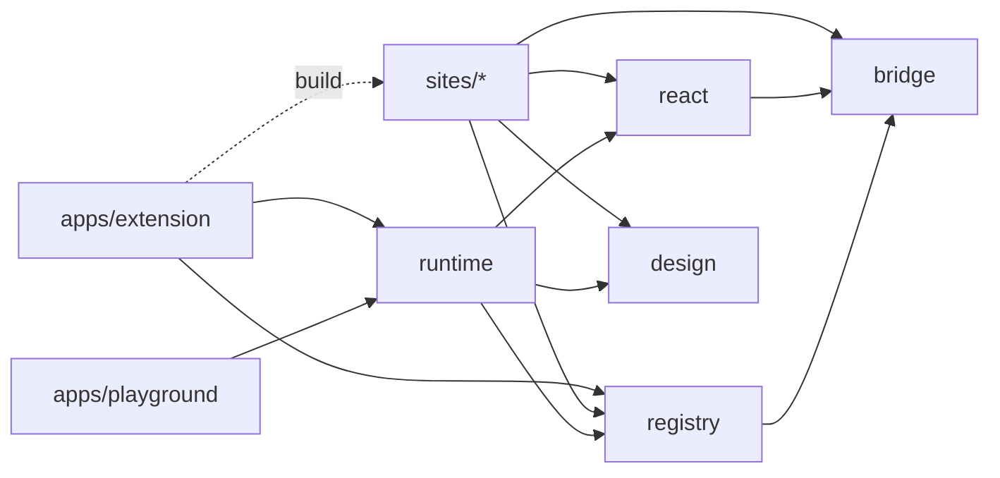
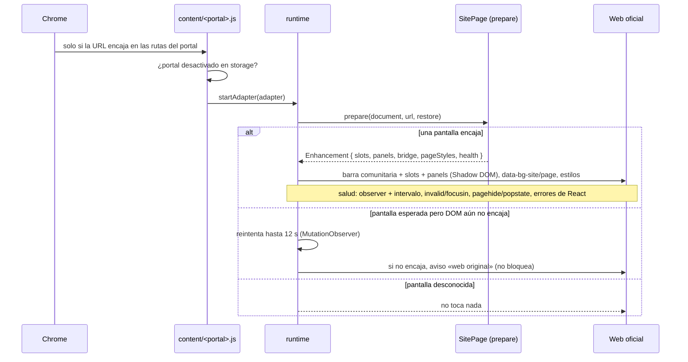

# Arquitectura

Cómo encajan las piezas de Reforma Digital. Para contribuir, lee [CONTRIBUTING.md](../CONTRIBUTING.md); para todo lo visual, [DESIGN.md](../DESIGN.md).

## Paquetes y límites



| Paquete             | Responsabilidad                                                                                                                                                                                 |
| ------------------- | ----------------------------------------------------------------------------------------------------------------------------------------------------------------------------------------------- |
| `packages/bridge`   | Única vía para tocar controles oficiales: `DomBridge` (campos y acciones, validez, cambios de identidad, sondeo para autofill), `fieldByLabel`, `requireElements`, `textOf`, `scrollToOfficial` |
| `packages/react`    | `BridgeProvider`, `useBoundField`, `BoundField`, `BoundButton`, `useDomValue`                                                                                                                   |
| `packages/registry` | Contrato `SiteAdapter` / `SitePage` / `Enhancement`, rutas (`routes` u `origins` + `pathPrefix`), validación de `site.config.json`                                                              |
| `packages/runtime`  | Monta `slots`, `panels` y la barra comunitaria en Shadow DOM, aplica `pageStyles`, vigila la salud y restaura; espera a contenido tardío                                                        |
| `packages/design`   | Sistema de diseño: tokens, preset de Tailwind, componentes React, temas por framework (`themes/morfos.css`)                                                                                     |
| `sites/<id>`        | Un portal: pantallas (`pages/<pantalla>/{page.tsx,bindings.ts}`), componentes, estilos, fixtures, pruebas                                                                                       |
| `apps/extension`    | Content script, popup y mensajes; `scripts/build.mjs` genera el manifest                                                                                                                        |
| `apps/playground`   | Laboratorio local: sirve los fixtures de cada portal (`fixtures/routes.json`) y los bindings de ejemplo                                                                                         |

`npm run check:workspaces` comprueba que cada paquete declara sus dependencias y que ningún portal importa código de otro portal ni de una aplicación.

## En el navegador



- **Un content script por portal.** `dist/content/<id>.js` lleva el runtime, React, el CSS compilado y solo ese portal. Chrome lo inyecta únicamente en las rutas de ese portal.
- **La web oficial hace el trabajo.** Los componentes cambian valores y activan acciones a través de `DomBridge`. Validación, navegación y envíos son siempre de la web oficial.
- **Restauración.** «Ver original» (barra o popup), desactivar el portal, un control oficial que cambia o desaparece, un error de React, la validación nativa sobre un control sustituido o un cambio de URL: todo devuelve la página original.
- **Mensajes.** El popup y `report.html` hablan con el content script de la pestaña (`status`, `restore`, `enable`, `capture`). Solo se aceptan mensajes desde esas URLs empaquetadas. En `chrome.storage.local` se guardan `disabledSites`, límites de avisos de reporte y rutas ya enviadas (hashes), nunca el HTML.
- **Pantallas sin adaptar.** Si la URL es del portal y ninguna pantalla la reclama (o el DOM no encaja), el runtime muestra un aviso. El reporte sale del popup → `report.html` (censura local + revisión + POST al intake). Ver [SECURITY.md](../SECURITY.md).

## Build

`npm run build` (`scripts/build.mjs`):

1. `scripts/sites.mjs` lee `sites/*/site.config.json` y los valida con `validateSiteConfig` del registro. Los portales desactivados no se compilan ni reciben permisos.
2. Compila el popup y `report.html` (entradas separadas; Rampart solo entra en el bundle de reporte).
3. Genera `pending.json` desde `sites/*/fixtures/inbox/*/meta.json` (sin red).
4. Compila un content script por portal (IIFE; Chrome no carga módulos ES como content script). Tailwind solo escanea el sistema de diseño, los paquetes comunes y ese portal.
5. Escribe el manifest: `storage`, `optional_host_permissions` del intake si `BG_INTAKE_ORIGIN` está definido, CSP `connect-src` acorde, un `content_scripts` por portal (`world: ISOLATED`, `all_frames: false`).

`npm run build:test` genera `dist-test/`, que además acepta el laboratorio local `127.0.0.1:4173`: cada ruta oficial se sirve con su mismo path y el content script la traduce al origen oficial.

`npm run audit:bundle` revisa el manifest y prohíbe en el bundle APIs de red (excepto `fetch` en `report/*`), `eval`, cookies y almacenamiento de página.

## Estilos

```
DESIGN.md → packages/design/src/tokens.css        variables --bg-*
          → packages/design/tailwind-preset.js     colores semánticos + componentes bg-btn, bg-field, bg-callout…
                ├→ src/shadow.css                  base de las interfaces en Shadow DOM (runtime)
                ├→ src/ui/*.tsx                    componentes React (Panel, Choice, Callout…)
                ├→ packages/react                  BoundField con las mismas clases
                └→ themes/morfos.css               web oficial con @apply de los MISMOS componentes
```

`packages/design/postcss.js` aplica Tailwind 3 con el preset y convierte `rem` → `px`, porque algunas webs oficiales cambian el tamaño base del `<html>`. Se usa Tailwind 3 porque la versión 4 registra variables con `@property`, que no se aplica dentro de Shadow DOM.

## Pruebas

| Capa                 | Dónde                                                                  | Red            |
| -------------------- | ---------------------------------------------------------------------- | -------------- |
| Estructura y límites | `npm run check:workspaces`                                             | No             |
| Unidad               | `packages/*/src/*.test.ts`, `sites/*/tests` (Vitest + jsdom, fixtures) | No             |
| Extensión cargada    | `tests/e2e/*.spec.ts` (Playwright headless + laboratorio)              | No             |
| Bundle               | `npm run audit:bundle`                                                 | No             |
| Diseño sin conexión  | `npm run site:record` una vez y después `npm run site:preview`         | Solo al grabar |
| Web real             | `npm run site:live -- <id>` (ventana visible, un recorrido)            | Sí             |
